# 🎨 Mermaid to Image Converter

> **Free Online Tool to Convert Mermaid Diagrams to High-Quality Images**

Transform your Mermaid diagram code into stunning PNG and SVG images instantly. No signup required, completely free, works entirely in your browser.

## ✨ Why Choose This Tool?

- **🆓 100% Free** - No hidden costs, no premium tiers, no limitations
- **🌐 No Registration** - Start creating immediately, no account needed  
- **⚡ Instant Results** - Real-time preview as you type
- **📱 Works Everywhere** - Desktop, tablet, mobile - fully responsive
- **🔒 Privacy First** - All data stays in your browser, nothing uploaded to servers
- **💾 Smart Auto-Save** - Never lose your work with intelligent auto-saving

## 🎯 Perfect For

- **Developers** creating technical documentation
- **Product Managers** designing workflow diagrams  
- **Students & Educators** making visual learning materials
- **Business Analysts** documenting processes
- **Anyone** who needs quick, professional diagrams

## 🚀 Live Demo

**Try it now:** [diagram-to-image-converter.onspace.app](https://diagram-to-image-converter.onspace.app)

### 🎨 **Export Quality Examples**

See the difference in export quality and formats:

| Standard Resolution (1x) | High Resolution (5x) |
|--------------------------|----------------------|
|  |  |
| Perfect for web use | Print-quality output |

*Compare the sharpness and detail in our high-resolution exports*

## 📊 Supported Diagram Types

| Type | Description | Perfect For |
|------|-------------|-------------|
| **Flowchart** | Process flows & decision trees | Software workflows, business processes |
| **Sequence** | System interactions & API calls | Software architecture, user journeys |
| **Class** | Object-oriented design | Database schemas, software design |
| **State** | System states & transitions | UI flows, state machines |
| **ER Diagram** | Entity relationships | Database design, data modeling |
| **User Journey** | User experience mapping | Product design, customer experience |
| **Gantt** | Project timelines | Project management, scheduling |
| **Pie Chart** | Data visualization | Reports, analytics dashboards |
| **Quadrant** | Strategic analysis | Business strategy, decision matrices |
| **Requirement** | System requirements | Software specs, compliance docs |
| **Mindmap** | Brainstorming & knowledge mapping | Planning, idea organization |
| **Timeline** | Historical data & roadmaps | Project milestones, company history |
| **Sankey** | Flow visualization | Data flow, process optimization |
| **XY Chart** | Statistical data | Analytics, performance metrics |

## 🎨 Visual Themes

Choose from 3 stunning visual styles:

- **🎯 Classic** - Clean, professional lines for business documentation
- **✏️ Hand-drawn** - Sketchy, approachable style for presentations  
- **🎨 Draw.io Style** - Authentic hand-drawn aesthetics using Rough.js

## 🛠️ Key Features

### **Export & Sharing**
- **PNG Export** - Up to 5x resolution for print-quality images
- **SVG Export** - Vector graphics that scale perfectly
- **Clipboard Copy** - One-click copy to paste into presentations
- **Background Options** - White, black, or transparent backgrounds

### **Professional Editor**
- **Monaco Editor** - The same editor that powers VS Code
- **Real-time Preview** - See changes instantly as you type
- **Syntax Highlighting** - Easy-to-read Mermaid code formatting
- **Error Detection** - Helpful error messages with line numbers
- **Undo/Redo** - Full edit history with keyboard shortcuts

### **Smart File Management**
- **Auto-Save** - Saves every 5 seconds when you're editing
- **File Browser** - Organize multiple diagrams like an IDE
- **Auto-Naming** - Smart file names based on diagram type and timestamp
- **Local Storage** - Everything saved securely in your browser

### **Advanced Controls**
- **Pan & Zoom** - Navigate large diagrams with smooth controls
- **Fullscreen Mode** - Distraction-free editing experience
- **Mobile Optimized** - Collapsible panels for small screens

## 🌍 Global Accessibility

**Multi-language support for international teams:**
- 🇺🇸 English
- 🇨🇳 Chinese Simplified  
- 🇯🇵 Japanese
- 🇩🇪 German
- 🇰🇷 Korean
- 🇮🇩 Indonesian
- 🇫🇷 French

## 🔧 Tech Stack

- **Frontend**: Vanilla JavaScript, HTML5, CSS3
- **Editor**: Monaco Editor (VS Code's editor)
- **Diagram Engine**: Mermaid.js
- **Hand-drawn Style**: Rough.js
- **Styling**: Tailwind CSS
- **Build**: Single-file deployment for maximum compatibility

## 🚀 Quick Start

1. **Visit the app**: [diagram-to-image-converter.onspace.app](https://diagram-to-image-converter.onspace.app)
2. **Pick a diagram type** from the dropdown menu
3. **Start typing** your Mermaid code - preview updates in real-time!
4. **Export** your diagram as PNG, SVG, or copy to clipboard

### Example Mermaid Code:

Here's the actual Mermaid code that generated the high-quality diagrams shown above:

```mermaid
---
title: Software Development Lifecycle with CI/CD Pipeline
---
flowchart TD
    Start([🚀 Project Start]) --> Planning{Planning Phase}
    
    Planning -->|Requirements Gathering| ReqAnalysis[Requirements Analysis]
    Planning -->|Architecture Design| ArchDesign[System Architecture]
    Planning -->|Resource Planning| ResourcePlan[Resource Allocation]
    
    ReqAnalysis --> DevPhase[Development Phase]
    ArchDesign --> DevPhase
    ResourcePlan --> DevPhase
    
    subgraph Development ["🛠️ Development Environment"]
        DevPhase --> CodeReview{Code Review}
        CodeReview -->|Approved| UnitTest[Unit Testing]
        CodeReview -->|Rejected| BugFix[Fix Issues]
        BugFix --> CodeReview
        UnitTest --> Integration[Integration Testing]
        Integration --> BuildCheck{Build Success?}
        BuildCheck -->|Failed| BugFix
        BuildCheck -->|Passed| Staging[Staging Environment]
    end
    
    subgraph CICD ["🔄 CI/CD Pipeline"]
        Staging --> AutoTest[Automated Testing]
        AutoTest --> SecurityScan[Security Scanning]
        SecurityScan --> PerformanceTest[Performance Testing]
        PerformanceTest --> QualityGate{Quality Gate}
        QualityGate -->|Failed| Rollback[Rollback Changes]
        QualityGate -->|Passed| Deploy[Deploy to Production]
        Rollback --> BugFix
    end
    
    subgraph Production ["🌐 Production Environment"]
        Deploy --> Monitor[Monitoring & Logging]
        Monitor --> HealthCheck{Health Check}
        HealthCheck -->|Issues Found| Alert[Alert Team]
        HealthCheck -->|All Good| Analytics[Performance Analytics]
        Alert --> Hotfix[Emergency Hotfix]
        Hotfix --> Monitor
        Analytics --> Feedback[User Feedback]
    end
    
    subgraph Maintenance ["🔧 Maintenance & Support"]
        Feedback --> Evaluate{Needs Update?}
        Evaluate -->|Major Changes| Planning
        Evaluate -->|Minor Changes| DevPhase
        Evaluate -->|No Changes| EndCycle[End Cycle]
    end
    
    %% Styling
    classDef startEnd fill:#e1f5fe,stroke:#01579b,stroke-width:3px,color:#000
    classDef process fill:#f3e5f5,stroke:#4a148c,stroke-width:2px,color:#000
    classDef decision fill:#fff3e0,stroke:#e65100,stroke-width:2px,color:#000
    classDef testing fill:#e8f5e8,stroke:#1b5e20,stroke-width:2px,color:#000
    classDef deploy fill:#fce4ec,stroke:#880e4f,stroke-width:2px,color:#000
    classDef alert fill:#ffebee,stroke:#c62828,stroke-width:3px,color:#000
    
    class Start,EndCycle startEnd
    class ReqAnalysis,ArchDesign,ResourcePlan,DevPhase,BugFix,Integration,Staging,AutoTest,SecurityScan,Deploy,Monitor,Analytics,Feedback,Hotfix process
    class Planning,CodeReview,BuildCheck,QualityGate,HealthCheck,Evaluate decision
    class UnitTest,PerformanceTest testing
    class Rollback,Alert alert
    
    %% Link styling
    linkStyle 0 stroke:#2196f3,stroke-width:3px
    linkStyle 15 stroke:#4caf50,stroke-width:3px
    linkStyle 20 stroke:#f44336,stroke-width:3px
```

**This example demonstrates:**
- ✅ **Complex flowchart** with multiple decision points and loops
- ✅ **Subgraph organization** for different development phases  
- ✅ **Custom styling** with colors and stroke widths
- ✅ **Emoji integration** for visual appeal
- ✅ **Professional layout** suitable for technical documentation

## ⌨️ Keyboard Shortcuts

| Shortcut | Action |
|----------|--------|
| `Ctrl + S` | Export as SVG |
| `Ctrl + P` | Export as PNG |
| `Ctrl + C` | Copy to clipboard |
| `Ctrl + Z` | Undo |
| `Ctrl + Y` | Redo |
| `Ctrl + Shift + Enter` | Toggle fullscreen |
| `Esc` | Exit fullscreen |

## 🤝 Contributing

We love contributions! Here's how you can help:

### **🐛 Found a Bug?**
Open an issue with:
- Steps to reproduce
- Expected vs actual behavior  
- Browser and OS details
- Screenshot if applicable

### **💡 Have an Idea?**
We'd love to hear your feature suggestions! Open an issue with:
- Clear description of the feature
- Use case or problem it solves
- Any implementation ideas

### **🔧 Want to Code?**
1. Fork the repository
2. Create a feature branch (`git checkout -b feature/amazing-feature`)
3. Commit your changes (`git commit -m 'Add amazing feature'`)
4. Push to the branch (`git push origin feature/amazing-feature`)
5. Open a Pull Request

## 📝 License

This project is licensed under the **MIT License** - see the [LICENSE](LICENSE) file for details.

**What this means:**
- ✅ Commercial use allowed
- ✅ Modification allowed  
- ✅ Distribution allowed
- ✅ Private use allowed

## 🙏 Acknowledgments

- **[Mermaid.js](https://mermaid.js.org/)** - The amazing diagram syntax that powers this tool
- **[Monaco Editor](https://microsoft.github.io/monaco-editor/)** - Professional code editing experience
- **[Rough.js](https://roughjs.com/)** - Hand-drawn style graphics
- **[Tailwind CSS](https://tailwindcss.com/)** - Utility-first CSS framework

## 📞 Support & Feedback

- **🐦 Twitter**: [@WilliamPenrose_](https://x.com/WilliamPenrose_)
- **🌐 Live Tool**: [diagram-to-image-converter.onspace.app](https://diagram-to-image-converter.onspace.app)
- **📖 Mermaid Docs**: [Official Mermaid Documentation](https://mermaid.js.org/syntax/flowchart.html)

---

## ⭐ Show Your Support

If this tool helped you create amazing diagrams, please consider:
- ⭐ **Starring this repository**
- 🐦 **Sharing on social media** 
- 💬 **Telling your colleagues**
- 🐛 **Reporting issues** to help us improve

**Made with ❤️ for the developer community**

*Powered by [OnSpace - AI App Builder](https://onspace.ai)*
